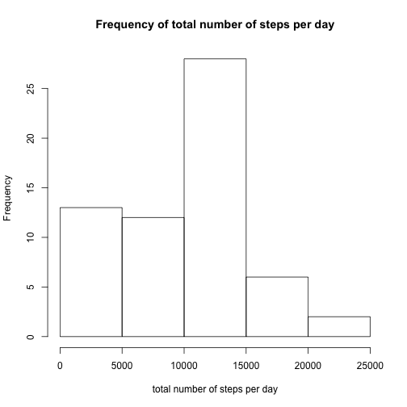
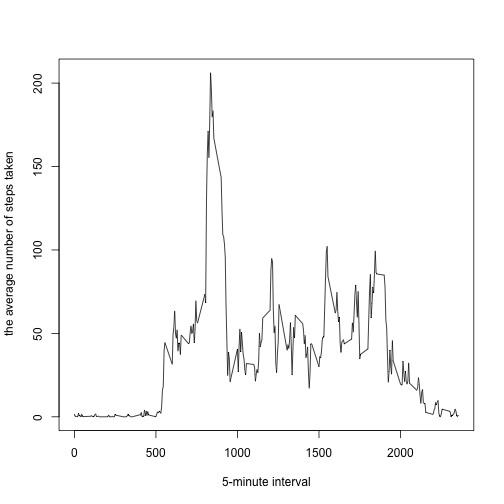
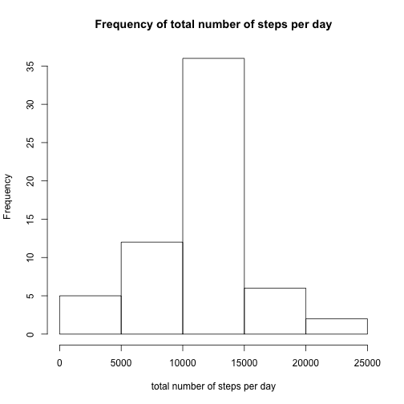
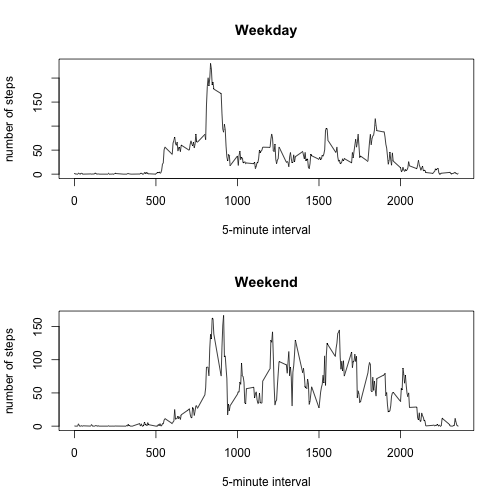

# assignment1 for exploratory analysis

##Loading and preprocessing the data
data preprocessing by formating "date"

```r
setwd("~/Desktop/exploratory")
Sys.setlocale("LC_ALL","C")
```

```
## [1] "C/C/C/C/C/ja_JP.UTF-8"
```

```r
act<-read.csv("activity.csv")
DateConvert=as.Date(strptime(act$date,"%Y-%m-%d"))
act$date<-DateConvert
str(act)
```

```
## 'data.frame':	17568 obs. of  3 variables:
##  $ steps   : int  NA NA NA NA NA NA NA NA NA NA ...
##  $ date    : Date, format: "2012-10-01" "2012-10-01" ...
##  $ interval: int  0 5 10 15 20 25 30 35 40 45 ...
```

##What is mean total number of steps taken per day?
drawing histogram

```r
ag<-aggregate(x=list(sumOfSteps=act$steps),by=list(date=act$date),FUN=sum,na.rm=T)
hist(ag$sumOfSteps,xlab="total number of steps per day",main="Frequency of total number of steps per day")
```



calculate median and meadn

```r
mean(ag$sumOfSteps)
```

```
## [1] 9354.23
```

```r
median(ag$sumOfSteps)
```

```
## [1] 10395
```
##What is the average daily activity pattern?
a time series plot

```r
ag2<-aggregate(x=list(aveOfSteps=act$steps),by=list(interval=act$interval),FUN=mean,na.rm=T)
plot(ag2$interval,ag2$aveOfSteps,type="l",xlab="5-minute interval",ylab=" the average number of steps taken")
```


5-minute interval containing the maximum number of steps

```r
ag2$interval[which.max(ag2$aveOfSteps)]
```

```
## [1] 835
```
##Imputing missing values
total number of missing values in the dataset

```r
sum(is.na(act$steps))
```

```
## [1] 2304
```
Create a new dataset that is equal to the original dataset but with the missing data filled in.
I did this by filling in all of the missing values in the dataset by the mean for that 5-minute interval.

```r
newdataframe=data.frame(steps=act$steps,date=act$date,interval=act$interval)
for (i in 1:nrow(newdataframe)){
if (is.na(newdataframe$steps[i])){
newdataframe$steps[i]=ag2[ag2$interval==newdataframe$interval[i],2]}}
```
a histogram of the total number of steps taken each day.

```r
newdataframe2<-aggregate(x=list(sumOfSteps=newdataframe$steps),by=list(date=newdataframe$date),FUN=sum,na.rm=T)
hist(newdataframe2$sumOfSteps,xlab="total number of steps per day",main="Frequency of total number of steps per day")
```


Calculate and report the mean and median total number of steps taken per day

```r
mean(newdataframe2$sumOfSteps)
```

```
## [1] 10766.19
```

```r
median(newdataframe2$sumOfSteps)
```

```
## [1] 10766.19
```
##Are there differences in activity patterns between weekdays and weekends?
Create a new factor variable in the dataset with two levels – “weekday” and “weekend” indicating whether a given date is a weekday or weekend day.

```r
weekdayOrWeekend=data.frame(steps=newdataframe$steps,date=act$date,interval=act$interval,weekdays=weekdays(act$date),weekdays2=1:nrow(act))
for (i in 1:nrow(weekdayOrWeekend)){
if (weekdayOrWeekend$weekdays[i]=="Sunday"|weekdayOrWeekend$weekdays[i]=="Saturday"){
weekdayOrWeekend$weekdays2[i]="weekend"} else {weekdayOrWeekend$weekdays2[i]="weekday"}}
weekdayOrWeekend$weekdays2<-as.factor(weekdayOrWeekend$weekdays2)
```
Make a panel plot containing a time series plot of the 5-minute interval (x-axis) and the average number of steps taken, averaged across all weekday days or weekend days (y-axis).

```r
weekdaydata<-subset(weekdayOrWeekend,weekdays2=="weekday")
weekenddata<-subset(weekdayOrWeekend,weekdays2=="weekend")
weekdayAg<-aggregate(x=list(aveOfSteps=weekdaydata$steps),by=list(interval=weekdaydata$interval),FUN=mean,na.rm=T)
weekendAg<-aggregate(x=list(aveOfSteps=weekenddata$steps),by=list(interval=weekenddata$interval),FUN=mean,na.rm=T)
par(mfrow=c(2,1))
plot(weekdayAg$interval,weekdayAg$aveOfSteps,type="l",xlab="5-minute interval",ylab="number of steps",main="Weekday")
plot(weekendAg$interval,weekendAg$aveOfSteps,type="l",xlab="5-minute interval",ylab="number of steps",main="Weekend")
```




